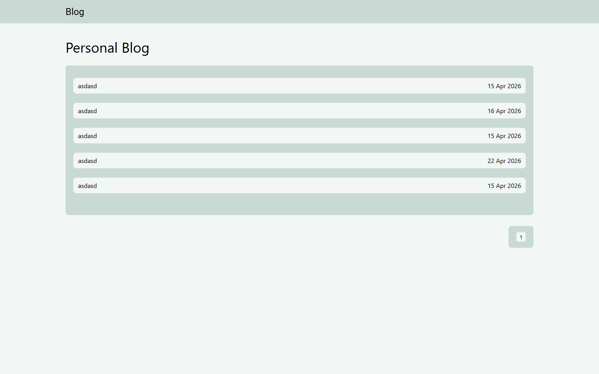

#  Personal Blog (Node.js + EJS)

A simple personal blog application where you can create, edit, and manage articles through an admin panel, while guests can browse and read published posts.

---
**Project URLs:** 
* [GitHub - Personal blog Web](https://github.com/HikmatKhiva/nodeJs-projects/tree/main/personal-blog)
* [Roadmap](https://roadmap.sh/projects/personal-blog)
## DEMO


###  Guest Section
Accessible to everyone:

- **Home Page**
  - Displays a list of all published articles
- **Article Page**
  - Shows full article content
  - Displays publication date

---

###  Admin Section
Restricted access (login required):

- **Dashboard**
  - View all articles
  - Add, edit, or delete posts

- **Add Article Page**
  - Create new blog posts
  - Fields: title, content, publication date

- **Edit Article Page**
  - Update existing articles

- **Delete Article**
  - Remove articles from the blog

---

##  Tech Stack

- **Backend:** Node.js, Express.js  
- **Frontend:** HTML, CSS, EJS  
- **Storage:** File system (JSON files)  
- **Authentication:** Basic session-based login (hardcoded credentials)

##  Login & Password

```bash
login: admin
password: 1234
```
## 🚀 Quick Start

```bash
# project build
npm run build

#  server run
npm run start

# server running
http://localhost:3000
```


```json
{
  "title": "Sample Title",
  "content": "Article content...",
  "date": "2026-01-01"
}

```