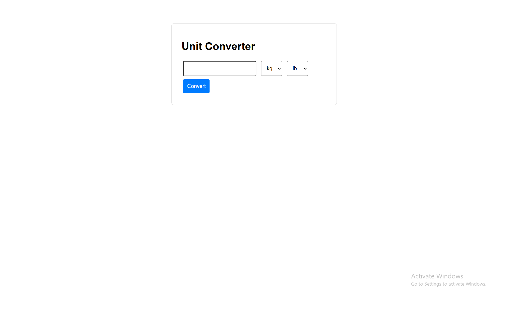

# Unit Converter

A lightweight **Node.js** unit converter app that converts **weight, temperature, and length** units.  
Built with **pure Node.js**, TypeScript, and minimal dependencies — no Express or other frameworks.


**Project URLs:** 
* [GitHub - task-tracker CLI](https://github.com/HikmatKhiva/nodeJs-projects/tree/main/task-tracker%20CLI)
* [Roadmap](https://roadmap.sh/projects/unit-converter)

## DEMO


---

## Features

- Convert units between:
  - Weight: `kg ↔ lb`
  - Temperature: `°C ↔ °F`
  - Length: `m ↔ ft`
- Minimal and lightweight
- Pure Node.js + TypeScript
- Custom template engine for HTML rendering
- Static asset handling (`CSS`, `JS`, `favicon`, `manifest`)
- SEO-ready (`robots.txt` support)
- Fully testable using **Vitest** or Node’s built-in test runner

---

## 🚀 Quick Start

```bash
# project build
npm run build

#  server run
npm run start

# with docker
npm run docker
# server running
http://localhost:3000
```

